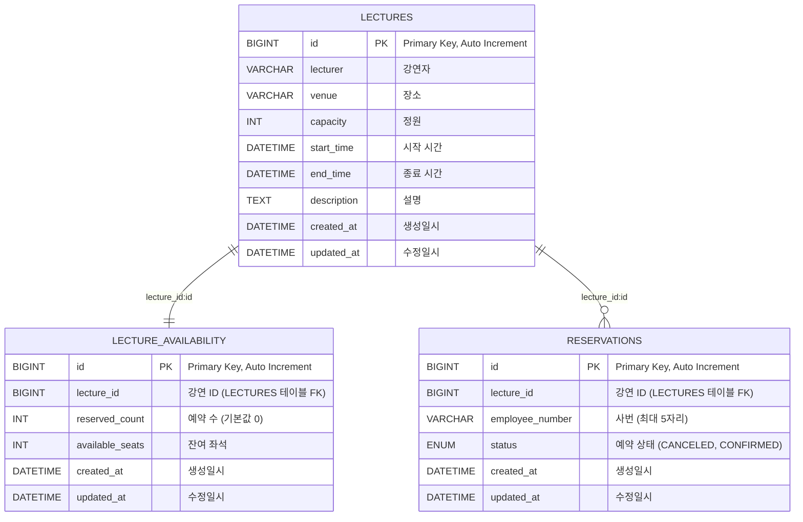

# lecture
## 개발 언어
### Java 21

---
## 프레임워크
### Spring Boot 3.4.2
### Spring Boot Starter Data JPA
### Spring Boot Starter Validation
### Spring Boot Starter Web
### Spring Boot Starter Test
### Lombok
### MySQL Connector/J
### Spring Retry
### Spring Aspects
- Gradle을 빌드 도구로 사용했습니다.

## RDBMS
### MySQL 8.0.4 1
- 익숙하며, 최신 기능과 안정된 성능, Spring Boot와의 호환성 때문에 MySQL 8.0.4를 선택했습니다.
## 데이터 설계

```mysql
-- lectures 테이블: 강연 정보 저장
CREATE TABLE lecture.lectures (
    id BIGINT NOT NULL AUTO_INCREMENT,             -- 기본 키, 자동 증가
    lecturer VARCHAR(255) NOT NULL,                -- 강연자 이름
    venue VARCHAR(255) NOT NULL,                   -- 강연 장소
    capacity INT NOT NULL,                         -- 강연 정원
    start_time DATETIME NOT NULL,                  -- 강연 시작 시간
    end_time DATETIME NOT NULL,                    -- 강연 종료 시간
    description TEXT,                              -- 강연 설명
    created_at DATETIME(6) NOT NULL,               -- 생성 일시 (정밀도 6)
    updated_at DATETIME(6) NOT NULL,               -- 수정 일시 (정밀도 6)
    PRIMARY KEY (id)
) ENGINE=InnoDB DEFAULT CHARSET=utf8mb4;

-- lecture_availability 테이블: 강연별 예약 가능 좌석 정보
CREATE TABLE lecture.lecture_availability (
    id BIGINT NOT NULL AUTO_INCREMENT,             -- 기본 키, 자동 증가
    lecture_id BIGINT NOT NULL,                    -- 참조: lectures 테이블의 id
    reserved_count INT NOT NULL DEFAULT 0,         -- 예약된 좌석 수 (기본값 0)
    available_seats INT NOT NULL,                  -- 사용 가능한 좌석 수
    created_at DATETIME(6) NOT NULL,               -- 생성 일시 (정밀도 6)
    updated_at DATETIME(6) NOT NULL,               -- 수정 일시 (정밀도 6)
    PRIMARY KEY (id),
    UNIQUE KEY `UNIQUE_lecture_availability` (`lecture_id`)  -- 한 강연에 대해 하나의 예약 가능 정보만 존재하도록 함
) ENGINE=InnoDB DEFAULT CHARSET=utf8mb4;

-- reservations 테이블: 강연 예약 정보 저장
CREATE TABLE lecture.reservations (
    id BIGINT NOT NULL AUTO_INCREMENT,             -- 기본 키, 자동 증가
    lecture_id BIGINT DEFAULT NULL,                -- 참조: lectures 테이블의 id (예약된 강연)
    employee_number VARCHAR(5) DEFAULT NULL,       -- 예약한 사원의 사번 (최대 5자리)
    status ENUM('CANCELED','CONFIRMED') DEFAULT NULL,  -- 예약 상태 (취소됨 또는 확정됨)
    created_at DATETIME(6) NOT NULL,               -- 생성 일시 (정밀도 6)
    updated_at DATETIME(6) NOT NULL,               -- 수정 일시 (정밀도 6)
    PRIMARY KEY (id),
    UNIQUE KEY `UNIQUE_reservations` (`lecture_id`, `employee_number`)  -- 동일 강연에 대해 같은 사번의 중복 예약 방지
) ENGINE=InnoDB DEFAULT CHARSET=utf8mb4 COLLATE=utf8mb4_0900_ai_ci;
```


## 그 밖에 고민하셨던 부분 또는 설명하고 싶으신 부분
### 0. 프로젝트 패턴 구조
단일 프로젝트 내에서 front와 backoffice를 한 번에 생성하였으며, 동일한 entity를 `common 패키지`로 관리하여 패키지 관리의 복잡도를 줄였습니다. <br>
backoffice에는 CRUD가 명확한 특성을 고려하여 `트랜잭션 스크립트 패턴`을 적용하였으며, 이를 통해 트랜잭션 관리가 용이해졌습니다. <br>
또한, backoffice는 공통 로직의 호출 빈도가 낮고 각 기능별 비즈니스 로직이 일관적이어서 모듈 재사용성이 상대적으로 적은 상황에서도 이 패턴이 적합하다고 판단되었습니다. <br><br>
front에는 `퍼사드 패턴`을 적용하여 시스템 변경이 발생할 경우 코드에 미치는 영향을 최소화하고자 했습니다 <br>
이 패턴을 적용함으로써 내부 모듈 간의 복잡한 의존 관계를 줄이고, 변경 사항이 발생하더라도 클라이언트에 미치는 영향을 최소화했습니다. <br>
또한, 퍼사드 패턴은 각 기능에 접근하기 위한 일관된 인터페이스를 제공하므로, 확장성이 크게 향상되며, 시스템 전체의 응집도를 높이는 방향으로 생각했습니다. <br>
결론은 각 대상 서비스 별 패턴을 고려하여 구조를 생성했습니다.

### 1. 강연 예약 엔티티 락 처리 방식 변경
초기에는 강연 예약 시 강연 엔티티 전체에 `PESSIMISTIC_WRITE` 락을 적용하여 동시성 문제를 해결하려고 고려했습니다. <br>
그러나 코드 검증 시 다중 쓰레드 환경에서 동시 호출 시 락 경합과 데드락 가능성이 높아져 전체 시스템 성능에 부정적인 영향을 주었습니다. <br>
결과적으로, 강연 엔티티(Lecture)는 `PESSIMISTIC_WRITE` 대신 `LockModeType.NONE`을 사용하도록 변경했습니다. <br>
좌석 가용성(availableSeats) 관리는 별도의 lecture_availability 테이블에서 원자적인 조건부 UPDATE로 처리함으로써, 불필요한 락을 피하고 동시에 데이터 일관성을 보장할 수 있도록 설계했습니다.

### 2. 동시성 및 데이터 일관성 보장 전략
#### (1) 좌석 가용성 분리
강연의 전체 정보를 락하는 대신, 예약과 직접적으로 연관된 좌석 가용성만을 별도 테이블에서 관리합니다.
#### (2) 원자적 업데이트:
DB의 조건부 UPDATE 쿼리를 활용하여, lecture_availability.availableSeats 값이 0보다 큰 경우에만 좌석을 감소시키는 방식으로 동시 업데이트를 안전하게 처리합니다.
#### (3) 트랜잭션 분리 및 재시도
예약 생성이나 재활성화(취소된 예약의 재사용)와 같은 상태 변경 작업은 별도의 트랜잭션(REQUIRES_NEW)으로 분리하고, 재시도 로직을 통해 락 경합 시 자동 재시도하도록 구성했습니다.

### 3. 테스트 및 운영 환경 고려
#### (1) 동시성 테스트
강연 용량을 1로 설정하여 여러 스레드가 동시에 예약 요청할 때, 단 하나의 예약만 성공하고 나머지는 실패하는 것이 기대되는 동시성 테스트 결과를 통해 설계의 타당성을 검증했습니다.
#### (2) 낮은 트래픽 가정
사원 대상 예약 서비스로 트래픽이 크지 않다는 가정 하에, Redis와 같은 분산 락 도입보다는 DB 내 원자적 연산을 통한 관리 방식이 효율적이라는 결론을 내렸습니다.

### 4. 최종 결정
최종적으로, 강연 엔티티에 대한 `비관적 락(PESSIMISTIC_WRITE)` 대신 `LockModeType.NONE`을 적용하고, 동시성 관리의 핵심은 별도 좌석 가용성 테이블에서 원자적 조건부 업데이트로 처리하기로 결정했습니다.
이로써 불필요한 락 경합과 데드락 문제를 줄이고, 트랜잭션 범위도 최소화하여 전체 시스템의 성능과 안정성을 확보할 수 있었습니다.
