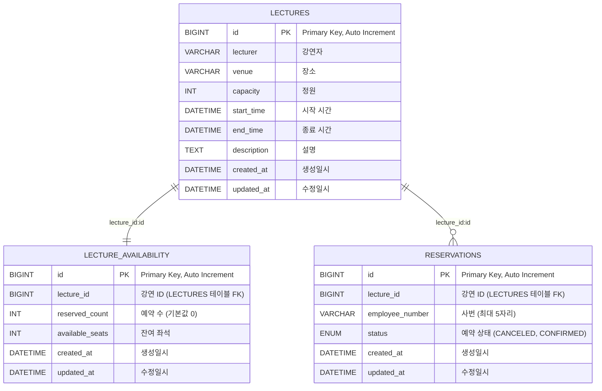

# lecture
## 개발 언어
### Java 21

---
## 프레임워크
### Spring Boot 3.4.2
### Spring Boot Starter Data JPA
### Spring Boot Starter Validation
### Spring Boot Starter Web
### Spring Boot Starter Test
### Lombok
### MySQL Connector/J
### Spring Retry
### Spring Aspects
- Gradle을 빌드 도구로 사용했습니다.

## RDBMS
### MySQL 8.0.4 1
- 익숙하며, 최신 기능과 안정된 성능, Spring Boot와의 호환성 때문에 MySQL 8.0.4를 선택했습니다.
## 데이터 설계

```mysql
-- lectures 테이블: 강연 정보 저장
CREATE TABLE lecture.lectures (
    id BIGINT NOT NULL AUTO_INCREMENT,             -- 기본 키, 자동 증가
    lecturer VARCHAR(255) NOT NULL,                -- 강연자 이름
    venue VARCHAR(255) NOT NULL,                   -- 강연 장소
    capacity INT NOT NULL,                         -- 강연 정원
    start_time DATETIME NOT NULL,                  -- 강연 시작 시간
    end_time DATETIME NOT NULL,                    -- 강연 종료 시간
    description TEXT,                              -- 강연 설명
    created_at DATETIME(6) NOT NULL,               -- 생성 일시 (정밀도 6)
    updated_at DATETIME(6) NOT NULL,               -- 수정 일시 (정밀도 6)
    PRIMARY KEY (id)
) ENGINE=InnoDB DEFAULT CHARSET=utf8mb4;

-- lecture_availability 테이블: 강연별 예약 가능 좌석 정보
CREATE TABLE lecture.lecture_availability (
    id BIGINT NOT NULL AUTO_INCREMENT,             -- 기본 키, 자동 증가
    lecture_id BIGINT NOT NULL,                    -- 참조: lectures 테이블의 id
    reserved_count INT NOT NULL DEFAULT 0,         -- 예약된 좌석 수 (기본값 0)
    available_seats INT NOT NULL,                  -- 사용 가능한 좌석 수
    created_at DATETIME(6) NOT NULL,               -- 생성 일시 (정밀도 6)
    updated_at DATETIME(6) NOT NULL,               -- 수정 일시 (정밀도 6)
    PRIMARY KEY (id),
    UNIQUE KEY `UNIQUE_lecture_availability` (`lecture_id`)  -- 한 강연에 대해 하나의 예약 가능 정보만 존재하도록 함
) ENGINE=InnoDB DEFAULT CHARSET=utf8mb4;

-- reservations 테이블: 강연 예약 정보 저장
CREATE TABLE lecture.reservations (
    id BIGINT NOT NULL AUTO_INCREMENT,             -- 기본 키, 자동 증가
    lecture_id BIGINT DEFAULT NULL,                -- 참조: lectures 테이블의 id (예약된 강연)
    employee_number VARCHAR(5) DEFAULT NULL,       -- 예약한 사원의 사번 (최대 5자리)
    status ENUM('CANCELED','CONFIRMED') DEFAULT NULL,  -- 예약 상태 (취소됨 또는 확정됨)
    created_at DATETIME(6) NOT NULL,               -- 생성 일시 (정밀도 6)
    updated_at DATETIME(6) NOT NULL,               -- 수정 일시 (정밀도 6)
    PRIMARY KEY (id),
    UNIQUE KEY `UNIQUE_reservations` (`lecture_id`, `employee_number`)  -- 동일 강연에 대해 같은 사번의 중복 예약 방지
) ENGINE=InnoDB DEFAULT CHARSET=utf8mb4 COLLATE=utf8mb4_0900_ai_ci;
```


## 그 밖에 고민하셨던 부분 또는 설명하고 싶으신 부분
* 강연 신청 시 고민했던 내용
  - 단일 서버 환경에서 예약 서비스의 데이터 일관성을 확보하기 위해, DB 유니크 제약을 적용하여 동일 강의에 대한 중복 예약을 방지했습니다.
  인기 강의의 경우 좌석이 한정되어 신청이 집중될 가능성이 있으나, 사원 대상 서비스이므로 스파이크성 트래픽은 크지 않다고 판단했습니다.
  초기에는 Redis 기반 분산 락인 Redisson 라이브러리를 고려하였으나, 단일 서버 환경에서 오히려 불필요한 오버헤드가 발생할 수 있어 도입하지 않기로 결정했습니다.
  대신, 비관적 락을 활용하여 예약 시 데이터에 즉시 락을 걸고, 데드락 발생 시 트랜잭션을 롤백하는 방식으로 동시성 문제를 해결했습니다.
  예약 서비스는 트랜잭션 충돌 가능성이 높아 낙관적 락을 적용할 경우 재시도 횟수가 많아져 성능 저하가 발생할 우려가 있으므로, 낙관적 락은 제외했습니다.
* 결론
  현재 구성은 단일 서버 환경에서 DB 유니크 제약과 비관적 락을 통해 데이터 일관성을 보장했습니다.
  다만, 분산 환경이라면 Redis 기반의 분산 락의 도입을 검토해볼 수 있을 것 같습니다.